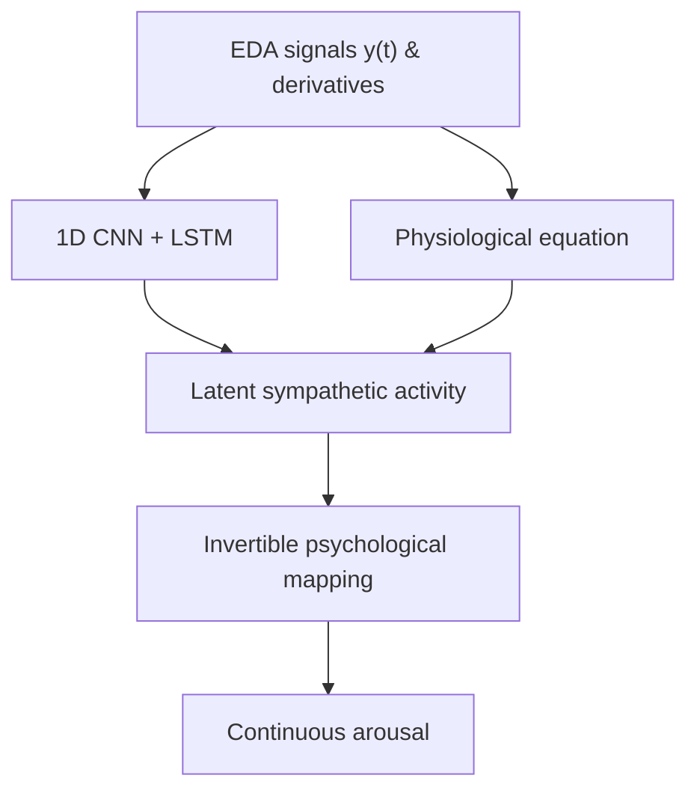

# README

## P3INN

A Physiology-Physics-Psychology Informed Neural Network for Inverse Decoding of Emotional Arousal 

P3INN is a physiology-informed deep learning framework that decodes continuous emotional arousal from electrodermal activity (EDA). It combines:

• a neural activity representation module based on a 1D CNN and a  LSTM;
• a physics constraint derived from the dynamic relationship between EDA signals and latent sympathetic neural activity; and
• a psychological mapping module that links the inferred sympathetic activity to continuous arousal through an invertible parametric function.

This repository provides the PyTorch implementation, preprocessing code, and a training example.


## Method overview




## Repository structure

```text
P3INN/
├── P3INN.py               # Model, physics-informed loss, data split, and plotting utilities
├── data_preprocessing.py  # Signal resampling, EDA cleaning/decomposition, and data export
├── run_example.py         # A training and evaluation example
└── README.md
```

## Requirements

• Python 3.9 or later
• PyTorch
• NumPy
• pandas
• scikit-learn
• SciPy
• Matplotlib
• NeuroKit2

A CUDA-capable GPU is recommended for the full experiment, although the code automatically falls back to CPU execution.

## Installation

```bash
git clone https://github.com/ss678901/P3INN.git
cd P3INN

conda create -n p3inn python=3.10 -y
conda activate p3inn

python -m pip install torch numpy pandas scikit-learn scipy matplotlib neurokit2
```

For a CUDA-enabled installation, select the PyTorch build appropriate for your system from the official installation guide.

## Dataset preparation

1. Download datasets

Download the full CASE & CEAP datasets. 

2. Run preprocessing

```bash
python data_preprocessing.py
```

3. Training and evaluation

Run the default experiment from the repository root:

```bash
python run_example.py
```

## Citation

## License

This repository does not currently include a license file. Please contact the authors before redistributing or reusing the code beyond the permissions provided by applicable law.

## Questions and issues

For questions, bug reports, or reproducibility problems, please open an issue in this repository.